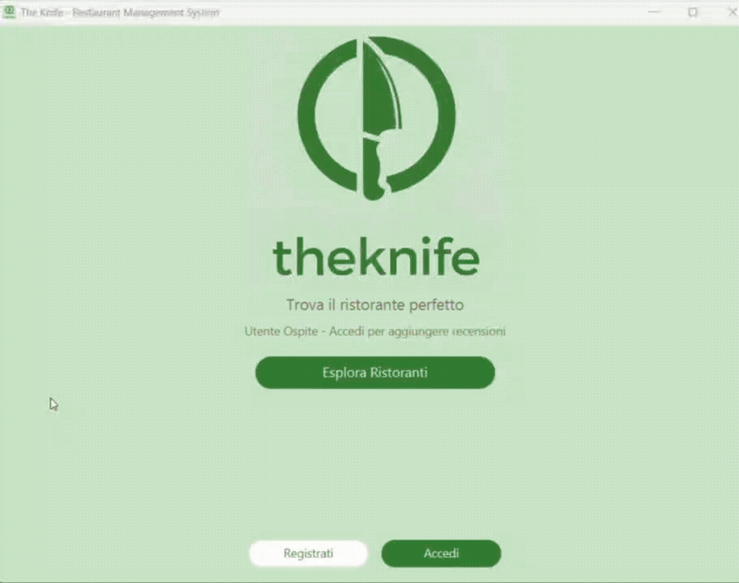

<p align="center">
  
</p>

--- 

# 🔪 TheKnife 

--- 

PROGETTO THEKNIFE
LABORATORIO A, CORSO DI LAUREA TRIENNALE IN INFORMATICA
UNIVERSITA' DEGLI STUDI DELL'INSUBRIA

MANUALE UTENTE, MANUALE TECNICO DISPONIBILI IN [doc](doc)

--- 

# 👥 AUTORI

- **[Oittijo Ahemmed Sarkar](https://github.com/ThatsKool)** - 759646 VARESE - Project manager, Design Manager
- **[Federico Barbotti](https://github.com/FedericoBarbotti)** - 752545 VARESE - System architect
- **[Bennajim Ali](https://github.com/alibennajim)** - 760125 VARESE - Document & quality manager

--- 

# 📦 DIPENDENZE PRINCIPALI

- **OpenJFX / JavaFx 21.0.4**
- **Apache Common CSV**
- **Junit Jupiter 5.9.1**
- **Gradle OPENJFX Plugin 0.1.0**
- **Java JDK 17 o superiore**

--- 

# 🖥️ SISTEMA OPERATIVO
L'applicazione è stata sviluppata per windows ma contiene tutte le librerie necessarie per l'esecuzione su altri sistemi operativi quali linux e mac. Tuttavia il corretto funzionamento dell'applicazione è garantito su sistemi windows. 

---

# ⚙️ AVVIO APPLICAZIONE

- Nella directory [bin](bin) scegliere il proprio sistema operativo e doppio click sul file `.jar`
- In alternativa sarà possibile far partire l'applicazione dal prompt dei comandi seguendo queste istruzioni:
```cmd
   cd <percorso in cui è stato estratto l'archivio>
```

```cmd
   gradlew run
```

---

## 📂 DOVE VENGONO SALVATI I DATI IN LOCALE

L'applicazione copia i file CSV dalle risorse interne in una cartella dati scrivibile dall'utente.  
I dati (utenti, ristoranti, recensioni, preferiti) vengono salvati nelle seguenti posizioni:

- **Windows**
  - Cartella base dati: `%USERPROFILE%\.theknife\data`

- **macOS**
  - Cartella base dati: `~/Library/Application Support/TheKnife/data`
  - Esempio: `/Users/<nome_utente>/Library/Application Support/TheKnife/data`

- **Linux / altri sistemi Unix-like**
  - Cartella base dati: `~/.local/share/theknife/data`
  - Esempio: `/home/<nome_utente>/.local/share/theknife/data`

All'interno di queste cartelle troverai i file:

- `users.csv`
- `michelin_my_maps.csv`
- `reviews.csv`
- `favorites.csv`

Se elimini questi file o l'intera cartella dati, al prossimo avvio l'app li ricreerà.

---

# 📹 BREVE VIDEO DELL'INTERFACCIA GRAFICA

<p align="center">
  
</p>
 
<p align="center">
  <video src="./data/foto/video_gui.mp4" controls>
    Il tuo browser non supporta il tag video.
  </video>
</p>

--- 

